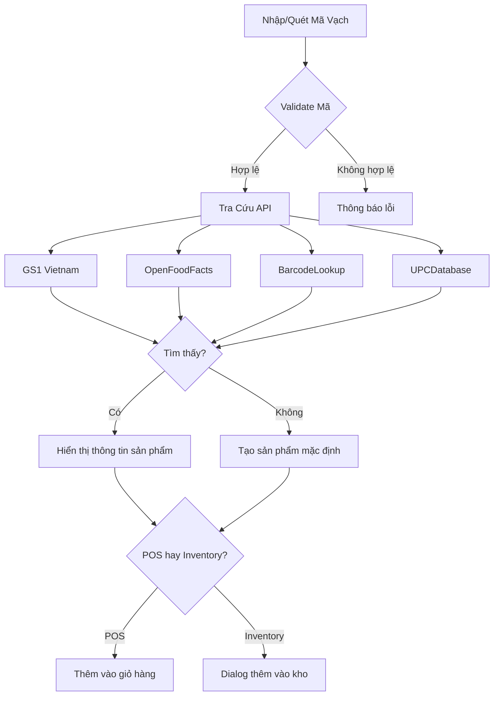

# 🔍 Hệ Thống Quét Mã Vạch Thống Nhất - G24Mart

## ✅ **ĐÃ HOÀN THÀNH** - Tích Hợp Tự Động Tương Thích

Hệ thống G24Mart giờ đây có **giao diện quét mã vạch thống nhất** tự động tương thích với tất cả các phương pháp quét, không cần phải chọn từng loại riêng lẻ.

## 🎯 **Tính Năng Chính**

### 📱 **Giao Diện Thống Nhất (`UnifiedBarcodeScanner`)**
- **Một ô nhập duy nhất** cho tất cả phương pháp
- **Tự động phát hiện** thiết bị và phương pháp phù hợp
- **Không cần chọn** từng loại scanner riêng
- **Giao diện responsive** tối ưu cho desktop và mobile

### 🔄 **Tự Động Tương Thích**
✅ **Nhập tay**: Gõ mã vạch và nhấn Enter  
✅ **Camera mobile**: Tự động hiện nút camera trên điện thoại  
✅ **Bàn phím scanner**: Tự động nhận diện quét từ máy quét USB  
✅ **Tra cứu API**: Tự động tìm thông tin sản phẩm từ nhiều nguồn

## 📍 **Vị Trí Tích Hợp**

### 1. **🛒 POS (Bán Hàng)** - `/pos`
**Chức năng**: Quét mã vạch để **thêm sản phẩm vào giỏ hàng**
```
┌─ Ô nhập mã vạch thống nhất ─┐
│ "Nhập mã vạch sản phẩm..."  │
│ [🔍 Tìm kiếm] [📱 Camera]   │
└─────────────────────────────┘
↓
✅ Tự động thêm vào giỏ hàng
```

### 2. **📦 Inventory (Quản Lý Kho)** - `/inventory`
**Chức năng**: Quét mã vạch để **thêm sản phẩm mới vào kho**
```
┌─ Ô nhập mã vạch thống nhất ─┐
│ "Nhập mã vạch để thêm..."   │
│ [🔍 Tìm kiếm] [📱 Camera]   │
└─────────────────────────────┘
↓
✅ Tra cứu thông tin → Thêm vào kho
```

## 🎮 **Cách Sử Dụng**

### **Phương Pháp 1: Nhập Tay (Universal)**
1. Click vào ô nhập mã vạch
2. Gõ mã số barcode
3. Nhấn **Enter** hoặc click **🔍 Tìm kiếm**
4. Hệ thống tự động xử lý

### **Phương Pháp 2: Camera (Mobile/Desktop)**
1. Click nút **📱 Camera**
2. Cho phép truy cập camera
3. Đưa mã vạch vào khung đỏ
4. Tự động quét và xử lý

### **Phương Pháp 3: Bàn Phím Scanner (Desktop)**
1. Click nút **⌨️ Bàn phím** (chỉ hiện trên desktop)
2. Sử dụng máy quét mã vạch USB
3. Quét trực tiếp, tự động nhận diện

### **Phương Pháp 4: Dán/Copy (Universal)**
1. Copy mã vạch từ bất kỳ đâu
2. Paste (Ctrl+V) vào ô nhập
3. Nhấn Enter để xử lý

## 🔄 **Quy Trình Xử Lý Tự Động**



## 📱 **Trải Nghiệm Mobile vs Desktop**

### **📱 Trên Điện Thoại:**
- **Nút Camera lớn, nổi bật** - màu xanh, chiếm tỷ lệ lớn
- **Tự động phát hiện** là thiết bị mobile
- **Fullscreen camera** với khung quét trực quan
- **Touch-friendly interface**
- **Âm thanh + rung** khi quét thành công

### **💻 Trên Máy Tính:**
- **Nút Camera nhỏ hơn** - chỉ là tùy chọn bổ sung
- **Nút Bàn Phím** nổi bật cho máy quét USB
- **Focus vào ô nhập** để gõ tay thuận tiện
- **Keyboard shortcuts** hỗ trợ

## 🎨 **Giao Diện Thống Nhất**

### **Component Layout:**
```
┌─────────────────────────────────────────┐
│ 🔍 Quét/Nhập Mã Vạch                   │
├─────────────────────────────────────────┤
│ [Input field với placeholder]          │
│ [🔍 Tìm kiếm] [📱 Camera] [⌨️ Bàn phím] │
├─────────────────────────────────────────┤
│ 📊 Trạng thái: Đang tra cứu...         │
├─────────────────────────────────────────┤
│ ✅ Kết quả: Coca Cola 330ml            │
│    Mã: 8934673001234                   │
│    Phương pháp: 📱 Camera              │
├─────────────────────────────────────────┤
│ 💡 Hướng dẫn sử dụng                   │
└─────────────────────────────────────────┘
```

## 🚀 **Lợi Ích So Với Trước**

### **❌ Trước đây:**
- Nhiều giao diện riêng lẻ cho từng loại scanner
- Phải chọn từng phương pháp
- Giao diện phức tạp, khó sử dụng
- Không tương thích tự động

### **✅ Bây giờ:**
- **Một giao diện duy nhất** cho tất cả
- **Tự động nhận diện** phương pháp phù hợp
- **Đơn giản, trực quan** - chỉ cần nhập/quét
- **Tương thích hoàn toàn** với mọi thiết bị

## 📊 **Kết Quả Cuối**

```
📱 MOBILE:
┌─────────────────────────────┐
│ [Input mã vạch...]         │
│ [📱 Quét Bằng Camera] ←──✨ │  Nút chính
│ [✏️ Nhập Thủ Công]         │
└─────────────────────────────┘

💻 DESKTOP:
┌─────────────────────────────┐
│ [Input mã vạch...]         │
│ [🔍] [📱] [⌨️] [✏️]       │  Đầy đủ tùy chọn
└─────────────────────────────┘
```

## 🎯 **Tóm Tắt**

**✅ HOÀN THÀNH** - Hệ thống giờ đây có **giao diện quét mã vạch thống nhất** tại cả POS và Inventory:

1. **Không cần chọn** từng loại scanner riêng
2. **Tự động tương thích** với tất cả phương pháp
3. **Một ô nhập** cho mọi cách quét/nhập
4. **Responsive** tối ưu cho mobile và desktop
5. **Đơn giản, trực quan** - chỉ cần nhập và Enter!

🎉 **Người dùng giờ chỉ cần nhập mã vào ô và hệ thống tự động xử lý tất cả!**
